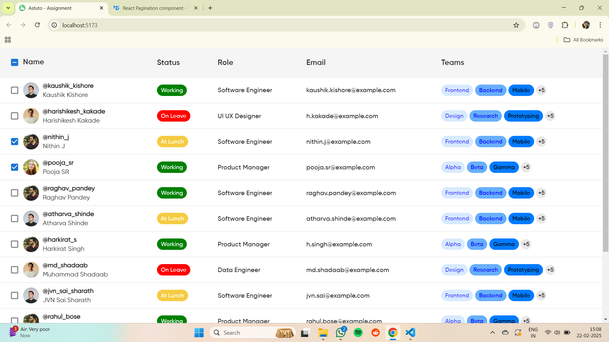
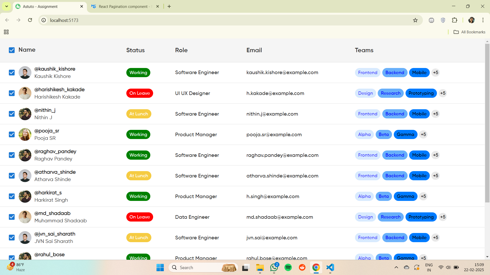
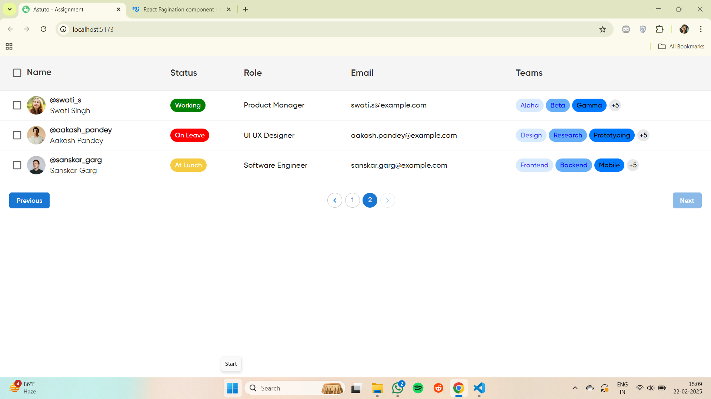

# Astuto Assignment

This project is built using **React** with **Vite** for fast development and optimized performance.

## Preview

Here are some preview images of the project:






## Getting Started

Follow the steps below to clone, install dependencies, and run the project locally.

### Clone the Repository

```sh
git clone https://github.com/ShadmanKhan10/astuto-assignment.git
npm install
npm run dev
